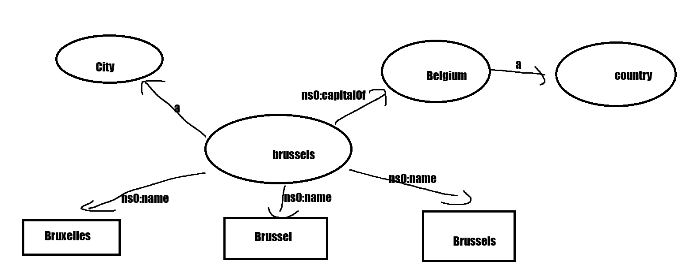

# 1 Translate RDF -> TTL

RDF/XML:
```xml
<rdf:RDF xmlns:rdf="http://www.w3.org/1999/02/22-rdf-syntax-ns#" xmlns:feup ="http://fe.up.pt/schema#"> 
 
  <rdf:Description rdf:about="http://fe.up.pt/lsf/doc.html"> 
  <feup:author> 
    <rdf:Description  
      rdf:about="http://fe.up.pt/liliana.ferreira#me"> 
        <feup:firstName>Liliana</feup:firstName> 
      </rdf:Description> 
    </feup:author> 
    <feup:theme>Web</feup:theme> 
  </rdf:Description> 
 
</rdf:RDF>
```

TTL: 

```ttl
@prefix ns0: <http://fe.up.pt/schema#> .

<http://fe.up.pt/lsf/doc.html>
  ns0:author <http://fe.up.pt/liliana.ferreira#me> ;
  ns0:theme "Web" .

<http://fe.up.pt/liliana.ferreira#me> ns0:firstName "Liliana" .
```

W3C Validation Service shows us a table with the 3 triples of the data model, with the Subject, Predicate and Object.

# 2 Describe, in your own words, what has been described or stated in the following RDF document. Try to draw the RDF graph using the following notation: ellipses for resources, labelled arrows for properties, and rectangles for values

This defines the entity Brussels, defined in example.org/geography#. It states that it is the capital of the entity Belgium, it is a ns0:City and it states it's name in 3 different languages. It also states that Belgium is a country.

RDF graph:



# 3 Convert to TURTLE

```ttl
@prefix ns0: <http://www.example.org/geography#> .

<http://www.example.org/geography#Brussels>
  ns0:capitalOf ns0:Belgium ;
  ns0:name "Bruxelles"@fr, "Brussel"@nl, "Brussels"@en ;
  a ns0:City .

ns0:Belgium a ns0:Country .
```

# 4 Extend the TTL File

```ttl
@prefix ns0: <http://www.example.org/geography#> .

<http://www.example.org/geography#Brussels>
  ns0:capitalOf ns0:Belgium ;
  ns0:name "Bruxelles"@fr, "Brussel"@nl, "Brussels"@en ;
  a ns0:City ;
  ns0:population 2000000^^xsd:int .

ns0:Belgium a ns0:Country ;
    ns0:population 5000000^^xsd:int .

ns0:Lisbon 
    a ns0:City ;
    ns0:capitalOf ns0:Portugal ;

ns0:Portugal a ns0:Country;
```
