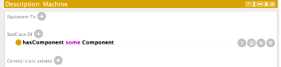

# Modeling Knowledge for Industrial Diagnostics 

## PART I - Conceptual Modelling: think like a knowledge engineer

Relationships and Attributes were retrieved from ChatGPT, as I'm not an Industrial Diagnostics domain expert, neither did I want to learn about it.

The following exercises consider a Cooling Unit of an Industrial Machine.

> Identify the Concepts (Classes)
- Machine
- Component
- Sensor
- Symptom
- Cause
- Procedure
- Operator

> Identify the Relationships (Object Properties) 

- Machine **hasComponent** Component
- Sensor **monitors** Component
- Sensor **detects** Symptom
- Procedure **resolves** Cause
- Procedure **addresses** Symptom
- Procedure **appliedTo** Component
- Machine **requires** Procedure
- Operator **performs** Procedure
- Operator **operates** Machine
- Cause **causes** Symptom
- Symptom **leadsTo** Symptom

> Add Attributes (Data Properties)

- Machine hasModel "CNC-X200"
- Machine hasInstallationDate "2022-06-15"
- Machine hasStatus "Operational"

- Component hasType "Bearing"
- Component hasMaterial "Steel"
- Component hasLifetimeHours 12000

- Sensor hasType "Temperature"
- Sensor hasValue 86.4
- Sensor hasAccuracy 0.98

- Symptom hasDescription "Overheating"
- Symptom hasSeverity "High"

- Cause hasDescription "Bearing wear"
- Cause hasProbability 0.82

- Procedure hasName "Replace bearing"
- Procedure hasDuration 2h
- Procedure hasPriority "High"

- Operator hasName "J. Silva"
- Operator hasRole "Maintenance Technician"

> Write 3–5 Triples

- :CoolingSystem :hasComponent :Fan .
- :Rute :performs :ReplaceBearing .
- :LowCoolantFlow :causes :Overheat .

> Sketch your ontology


> Reason

**Factual:** 

I believe the example answer is wrong ("Which components belong to SpindleMachine?") as this relies on the connection Machine -> Component. This should only rely on the data attributes.

1. What material is the fan made of? (Component hasMaterial "Steel")
2. What is Rute's Role? (Operator hasRole "Maintenance Technician")
3. What is the severity from overheating? (Symptom hasSeverity "High")
4. How long does it take to replace a fan? (Procedure hasDuration 2h)

**Relational:**

1. Which symptoms are caused by multiple causes?
2. Which sensor has detected more symptoms?
3. Which operator performs the FanFixing procedure?
4. How many machines does Rute operate?

**Inferred:**

1. If Rute operates MegaCoolerMachine and MegaCoolerMachine requires FanFixing, which procedure should Rute perform?
2. If FanFixing resolves Overheating, which symptoms have been addressed?
3. If FanSensor monitors the Fan component, which Machine is it monitoring?
4. If FanFault causes LowAirFlow and LowAirFlow leads to Overheat, what can be inferred about FanFault?

**Constraint Checking:**

1. Does every Machine have at least one Component?
2. Does every procedure resolve at least one cause?
3. Is every component status' valid?
4. Is every operator operating at least one machine or performing a procedure?

> Define One Rule or Restriction

- Every Machine must have at least one Component.

## PART II – Implement your ontology

Use of protege is not relevant for the exam, skipped this part.

**Important takeaway when creating ontologies:**

> To make the ontology intelligent, not just a glossary, you need to add the axioms you identified in the first part of this exercise. Use the Class Expression Editor available in the ‘SubClass Of’ tab for expressing your axioms.

Example: Every Machine has at least one Component



## PART III — SPARQL Querying & Reasoning over Your Ontology

> [!WARNING]
> This was done without verifying validity through a SPARQL query (as I didn't define the Ontology). I'm not sure these are 100% correct.

> Check whether your structural modeling (classes, properties, part–whole relations) is correct.

**(a) List all components of your main machine.**

```
SELECT ?component
WHERE {
    :MainMachine :hasComponent ?component .
}
```

Lists all components of the machine MainMachine. It will show the URI.

**(b) List all subcomponents of your cooling system.**

Cooling system is a component.

The following will work if the object property ``:hasSubcomponent`` is defined as transitive. Reason: partOf(x, y) ∧ partOf(y, z) ⇒ partOf(x, z)

```
SELECT ?subcomponent
WHERE {
    :CoolingSystem :hasSubcomponent ?subcomponent .
}
```

To do this without reasoner, we can use ``Property Path``. This is done using the ``+`` symbol, (e.g., ``:hasComponent+``), which allows 1 or more hop. More information about this can be seen [here](https://www.w3.org/TR/sparql11-property-paths/).

Therefore, the following SPARQL query doesn't need inference to work:
```
SELECT ?subcomponent
WHERE {
    :CoolingSystem :hasSubcomponent+ ?subcomponent .
}
```

**(c) List all sensors and what they observe. Check if every sensor is connected to something meaningful.**

Sensors observe components. In order for them to be connected to something meaningful they have to be connected to a Machine with imaginary priority value "High".

```
SELECT ?sensor ?component
WHERE {
    ?sensor :observes ?component .
    ?component ^:hasComponent ?machine .
    ?machine :priority ?priority .
    FILTER(lang(?priority), "en" && STR(?priority) = "High")
}
```

Easier approach:

```
SELECT ?sensor ?component
WHERE {
    ?sensor :observes ?component .
    ?component ^:hasComponent ?machine .
    ?machine :priority "High"@en .
}
```

> Diagnostics Queries

**(a) List all causes and the symptoms they generate.**

```
SELECT ?cause ?symptom
WHERE {
    ?cause :causes ?symptom
}
```

**(b) List all procedures and which cause they mitigate.**

```
SELECT ?procedure ?cause
WHERE {
    ?procedure :mitigates ?cause
}
```

> Multi-Step & Inferred Queries

**(a) Find all causes that are connected to SpindleOverheat through one or more intermediate symptoms or conditions.**

Here we assume SpindleOverheat is a Symptom. A symptom may cause other symptoms. Each symptom can have one or more causes.

```
SELECT ?cause
WHERE {
    :SpindleOverheat :leadsTo* ?symptom .
    ?symptom ^:causes ?cause .
}
```

**Extra context:** ``leadsTo`` connects Symptom -> Symptom. The usage of ``*`` allows ``?symptom`` to have all symptoms that were lead from ``:SpindleOverheat``, along with ``:SpindleOverheat`` themself. This way, we won't lose the cause of ``:SpindleOverheat``. ``:causes`` connects Cause -> Symptom, therefore we use ``^`` to traverse it backwards (inverse).

> Competency questions

**(a) Which components are monitored by sensors associated with abnormal vibration?**

Assuming abnormal vibration is a symptom and is represented by ``:AbnormalVibration``.

```
SELECT ?component
WHERE {
    :AbnormalVibration ^:detects ?sensor .
    ?sensor :monitors ?component .
}
```

**(b) Which procedures mitigate the root causes of spindle overheat?**

```
SELECT ?procedure
WHERE {
    :SpindleOverheat ^:causes ?cause .
    ?cause ^:resolves ?procedure .
}
```

I do this backwards to improve efficiency. If we started with every procedure than it would check every cause and then for every cause check every procedure and filter backwards. By starting at the the symptom we already have only 1 symptom to check, therefore let's say there are 5 causes and 3 procedures for each, this greatly reduces the number of needed traversals of the KG.

**(c) Which causes affect more than one component?**

```
SELECT ?cause
WHERE {
    ?cause :causes ?symptom .
    ?symptom ^:detects ?sensor .
    ?sensor :monitors ?component .
}
GROUP BY ?cause
HAVING(COUNT(DISTINCT ?component) > 1)
```