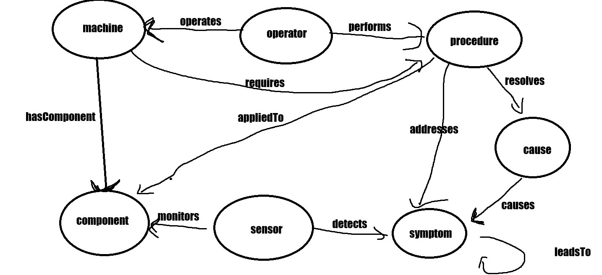

# Modeling Knowledge for Industrial Diagnostics 

## PART I - Conceptual Modelling: think like a knowledge engineer

Relationships and Attributes were retrieved from ChatGPT, as I'm not an Industrial Diagnostics domain expert, neither did I want to learn about it.

The following exercises consider a Cooling Unit of an Industrial Machine.

> Identify the Concepts (Classes)
- Machine
- Component
- Sensor
- Symptom
- Cause
- Procedure
- Operator

> Identify the Relationships (Object Properties) 

- Machine **hasComponent** Component
- Sensor **monitors** Component
- Sensor **detects** Symptom
- Procedure **resolves** Cause
- Procedure **addresses** Symptom
- Procedure **appliedTo** Component
- Machine **requires** Procedure
- Operator **performs** Procedure
- Operator **operates** Machine
- Cause **causes** Symptom
- Symptom **leadsTo** Symptom

> Add Attributes (Data Properties)

- Machine hasModel "CNC-X200"
- Machine hasInstallationDate "2022-06-15"
- Machine hasStatus "Operational"

- Component hasType "Bearing"
- Component hasMaterial "Steel"
- Component hasLifetimeHours 12000

- Sensor hasType "Temperature"
- Sensor hasValue 86.4
- Sensor hasAccuracy 0.98

- Symptom hasDescription "Overheating"
- Symptom hasSeverity "High"

- Cause hasDescription "Bearing wear"
- Cause hasProbability 0.82

- Procedure hasName "Replace bearing"
- Procedure hasDuration 2h
- Procedure hasPriority "High"

- Operator hasName "J. Silva"
- Operator hasRole "Maintenance Technician"

> Write 3–5 Triples

- :CoolingSystem :hasComponent :Fan .
- :Rute :performs :ReplaceBearing .
- :LowCoolantFlow :causes :Overheat .

> Sketch your ontology

> Reason

**Factual:** 

I believe the example answer is wrong ("Which components belong to SpindleMachine?") as this relies on the connection Machine -> Component. This should only rely on the data attributes.

1. What material is the fan made of? (Component hasMaterial "Steel")
2. What is Rute's Role? (Operator hasRole "Maintenance Technician")
3. What is the severity from overheating? (Symptom hasSeverity "High")
4. How long does it take to replace a fan? (Procedure hasDuration 2h)

**Relational:**

1. Which symptoms are caused by multiple causes?
2. Which sensor has detected more symptoms?
3. Which operator performs the FanFixing procedure?
4. How many machines does Rute operate?

**Inferred:**

1. If Rute operates MegaCoolerMachine and MegaCoolerMachine requires FanFixing, which procedure should Rute perform?
2. If FanFixing resolves Overheating, which symptoms have been addressed?
3. If FanSensor monitors the Fan component, which Machine is it monitoring?
4. If FanFault causes LowAirFlow and LowAirFlow leads to Overheat, what can be inferred about FanFault?

**Constraint Checking:**

1. Does every Machine have at least one Component?
2. Does every procedure resolve at least one cause?
3. Is every component status' valid?
4. Is every operator operating at least one machine or performing a procedure?

> Define One Rule or Restriction

- Every Machine must have at least one Component.

## PART II – Implement your ontology