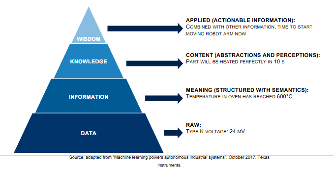

# Class 1 - Semantic Web and Linked Data Introduction

## Data, Information, Knowledge

**Data:** This corresponds to raw data from which we can't really take anything from. Knowing that something has Type K with voltage at 24 mV doesn't tell us anything, especially because we don't even know what that something is.

**Information:** Now we know something more, it is information, not just data. In the example we know that an Oven has temperature of 600ºC. We could imagina a table that has those fieds like: [Oven | 600ºC], where the columns are like [Object | Temperature]. Data becomes information when it is contextualized. Knowing "Oven | 600 °C" is information because it adds meaning to the raw temperature reading.

**Knowledge:** Now it's something more that has probably been tested. We know a toast will be heated perfectly after 10s in the oven at 600ºC.

**Wisdom:** Now we apply all our knowledge and infer something new. Knowing the Oven will reach 600ºC in 5 seconds, if the moving robot arm takes 3 seconds to move our toast to the oven, if we want to use the least amount of time possible, we should move it in 3 seconds, so that the toast is heated perfectly at the least amount of time possible.