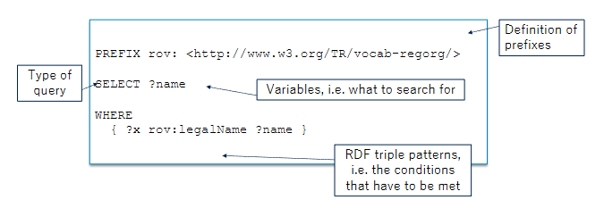
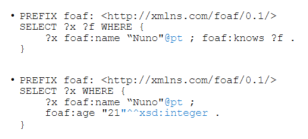

# SPARQL (SPARQL Protocol And RDF Query Language)

Query language that enables IR by querying RDF datasets. It also enables to update RDF datasets.

It allows us to:
- Pull values from structured and semi-structured data
- Explore data by querying unknown relationships
- Perform complex joins over different graphs in a single, simple query
- Including over different endpoints in a single, simple query
- Transform RDF data from one vocabulary to another

The structure of a query:




Question marks are variables:
```
SELECT ?subject ?property ?value 
WHERE { ?subject ?property ?value }
```

## Specify Language and DAtatype of Literals



## Optional

Tries to match, if it finds returns something like [x y], if not it returns [x  ]. Variables remain unbound and the query doesn't fail.

## Union allows different patterns

```
SELECT ?person ?name 
WHERE {   
    ?person foaf:name ?name .     
    {       
        ?person foaf:homepage <http://nuno.info> . 
    } 
    UNION    
    {      
        ?person foaf:homepage <http://nunes.org> . 
    } 
}
```

## Others:

- **Negation:** MINUS { ?x a ex:Man } in Where
- **Predefined Variable Values:** VALUES ?name { "Peter" "Pedro" "Pierre" } -> after Where
- **Variable Binding:**
```
PREFIX foaf: <http://xmlns.com/foaf/0.1/> 
SELECT ?person ?name 
WHERE { 
    ?person ex:fname ?fname ; 
          ex:lname ?lname . 
BIND (concat(?fname, ?lname) AS ?name) 
}
```
- **Property path:** Regular expressions on property path between resources, like +, *, ?, {n}, etc
- **DISTINCT:** SELECT DISTINCT
- **FILTER:** We can also use if (...), then, else
```
SELECT ?person ?name 
WHERE { 
  ?person rdf:type ex:Person ; 
  ex:name ?name ; 
  ex:age ?age . 
  FILTER (xsd:integer(?age) >= 18) 
}
```
To verify presence we can use FILTER NOT EXISTS or FILTER EXISTS
- **ORDER BY, LIMIT, OFFSET:** After WHERE
- **GROUP BY, HAVING, AVG, COUNT, ...:** After WHERE

## ASK

Returns boolean. It's used instead of select, where...
```ASK { ?person foaf:age 111 . }```

## Construct a Result Graph

The result is a new RDF graph

```CONSTRUCT { ?student a corp:FuturExecutive . }```

